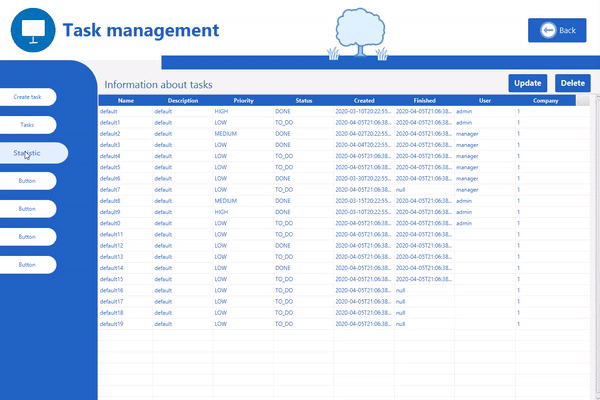

## PostgreSQL
Do używania funkcjonalności aplikacji należy odpalić lokalnie PosgreSQL.
Stworzyć ją można w następujący sposób z pomocą Docker(przed odpalaniem komend upewnij się że masz zainstalowany Docker na komputerze):

    docker run -d --name javaFX -p 7777:5432 -e POSTGRES_PASSWORD=secret postgres
    
    docker exec -ti <pierwsze 4 litery id contenera> psql -U postgres
    
    create database seconddb;
   
    
## Demo # Version: .V1777

 
 

## Statistic 
### Data from database

 
 

### Employee of the month/week

