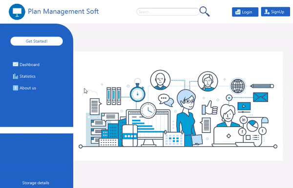

# Funkcjonalności
## [Admin]
* Dodawanie menedżerów
* Zarządzanie i wgląd w firmy
* Zarządzanie i wgląd w pracowników
* Generowanie raportów dotyczących danych statystycznych o firmach oraz pracownikach

## [Manager]
* Założenie firmy
* Generwanie kodów dostępu dla pracowników
* Dodawanie, edycja oraz zarządzanie zadaniami (zmiana statusu, piorytetu, przypisywanie zadań pracownikom)
* Generowanie raportów min o zadaniach, z podziałem na różne parametry jak np: piorytet, zadania ukończone, w trakcie realizacji,
wybór terminów.

## [Pracownik]
* Założenie konta z kodem dostępu -> trafienie do odpowiedniej firmy
* Tworzenie edycja, zarządzanie zadaniami.

## [All]
* Podgląd statystyk aplikacji
* Podgląd statystyk dotyczących najlepszego pracownika tygodnia/miesiąca firmy
* Edycja profilu
* Resetowanie hasła

## PostgreSQL
Do używania funkcjonalności aplikacji należy odpalić lokalnie PosgreSQL.
Stworzyć ją można w następujący sposób z pomocą Docker(przed odpalaniem komend upewnij się że masz zainstalowany Docker na komputerze):

    docker run -d --name javaFX -p 7777:5432 -e POSTGRES_PASSWORD=secret postgres
    
    docker exec -ti <pierwsze 4 litery id contenera> psql -U postgres
    
    create database seconddb;
   
    
## Demo # Version: .V1777

 
 

## Statistic 
### Data from database

 
 

### Employee of the month/week

